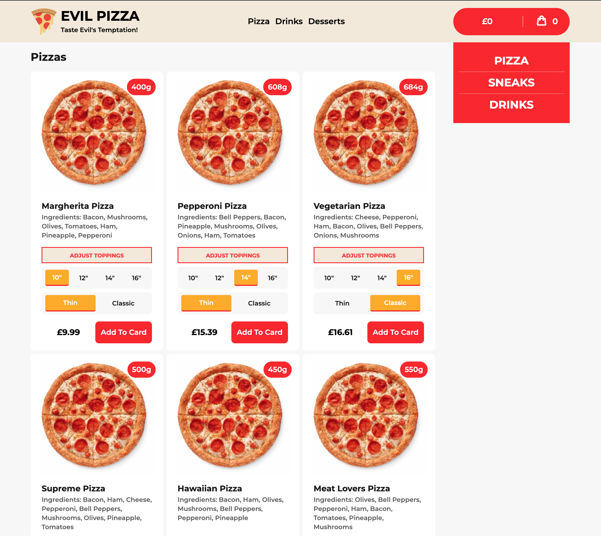
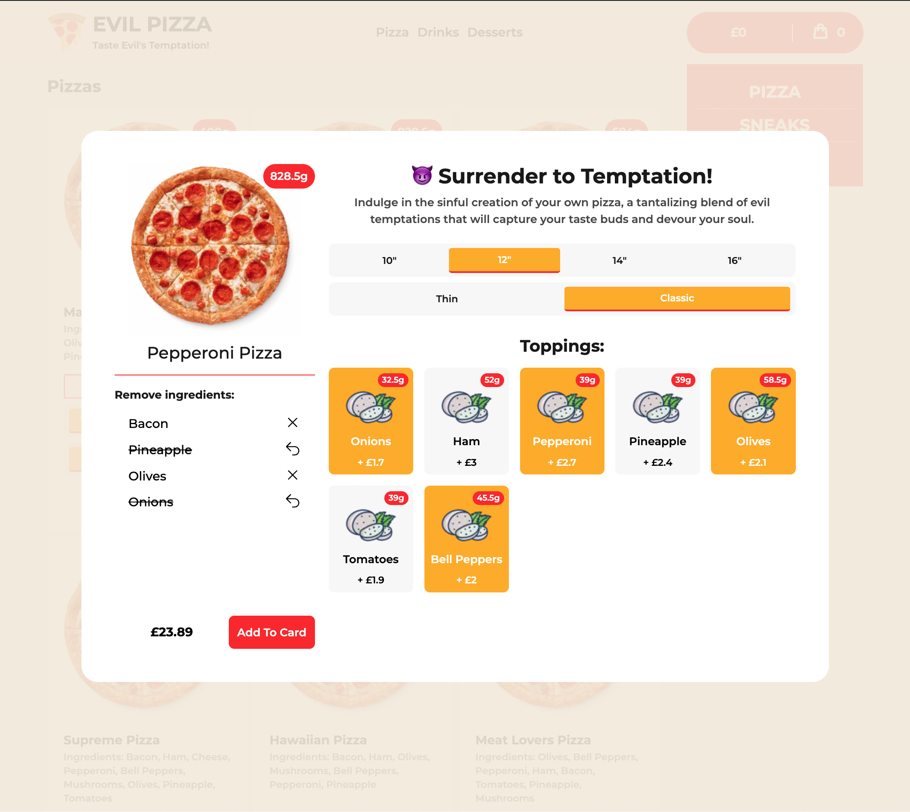
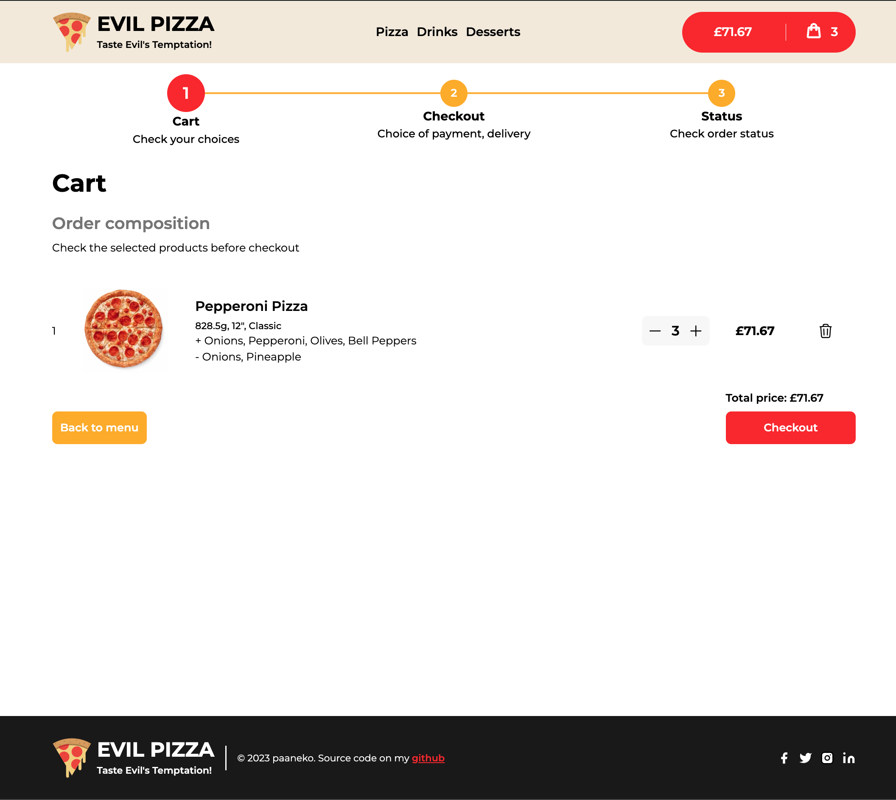
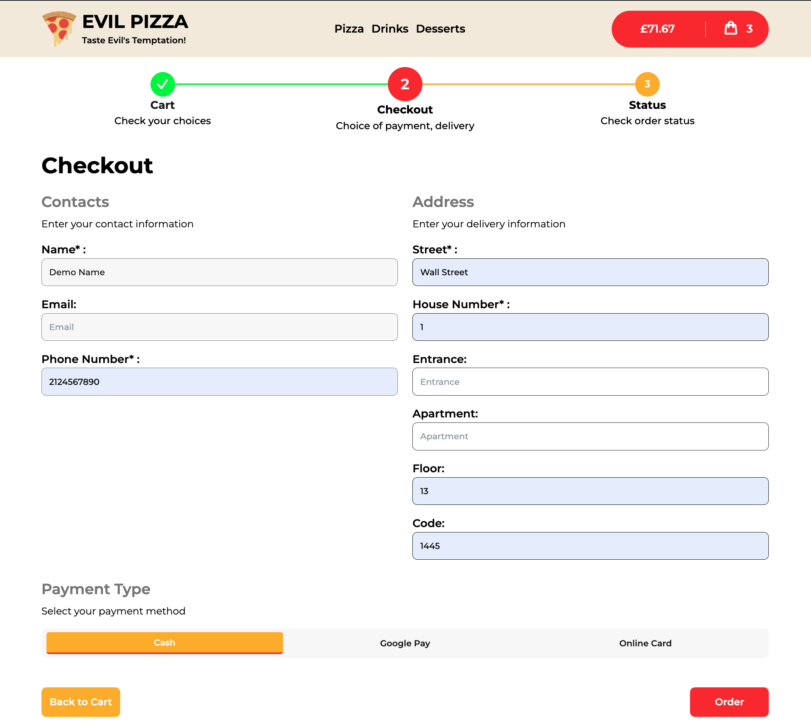
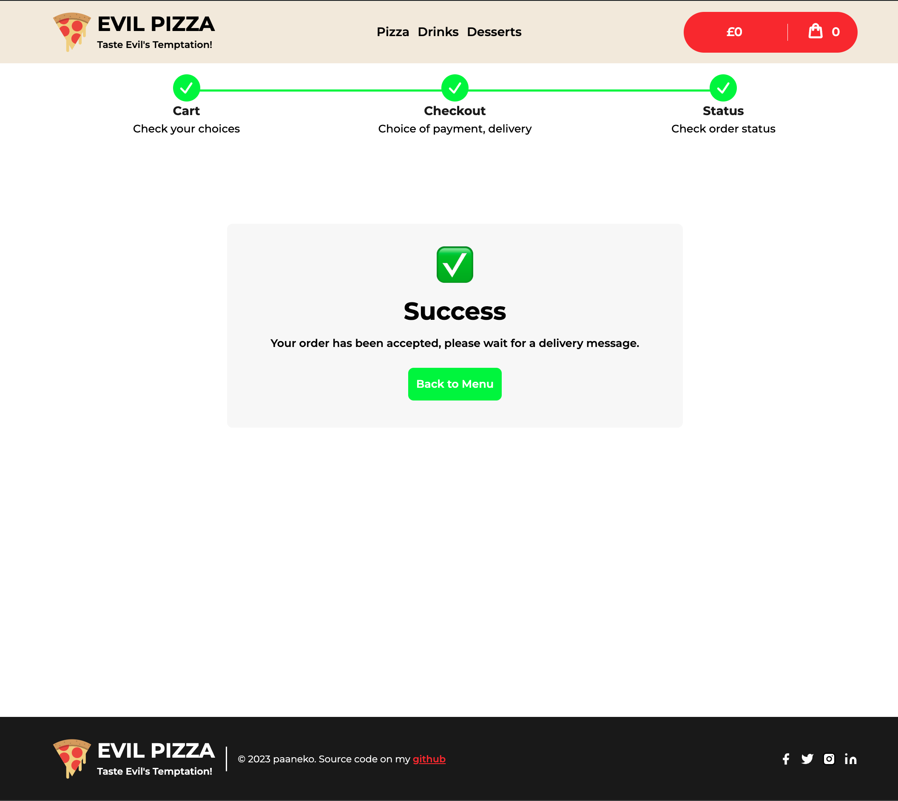
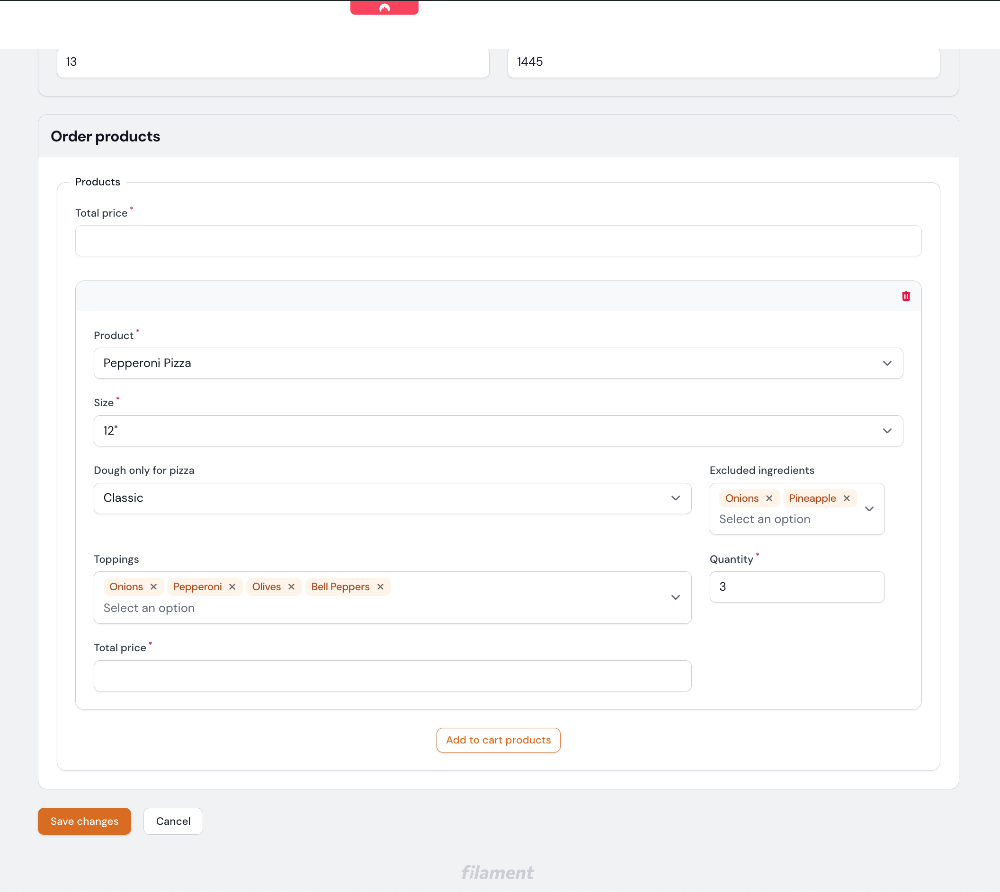

<p align="center">
    
    
</p>
<p align="center">
    
    
</p>
<p align="center">
    
    
</p>

An open source frontend application built using the **React** ⚛️ and **Feature-Sliced Design** 🍰.

- React, Redux Toolkit
- Next.js, TypeScript, Tailwind css
- Architecture based on Feature-Sliced Design

## Live demo


Admin Panel Credentials:
```bash
demo@gmail.com:root
```

- [BackEnd Admin Panel](http://evil-pizza-backend.my.to/admin)
- [FrontEnd](http://evil-pizza.my.to)

## About project

This application was created as a pet-project aimed at enhancing my skills in connecting front-end and back-end through APIs, and in designing complex database structures. The front-end utilizes modern technologies such as [Next.js](https://nextjs.org/), [Redux Toolkit](https://redux-toolkit.js.org/) and [TypeScript](https://www.typescriptlang.org/), and follows the [Feature Sliced Design](https://feature-sliced.design/) methodology for project architecture.

## Features

- **Interface:** Intuitive UI for customizing pizza with options such as:
  - **Sizes:** Choose from multiple pizza sizes.
  - **Toppings:** Select your preferred toppings.
  - **Dough Thickness:** Opt for different dough thicknesses.
  - **Ingredient Management:** Easily add or remove ingredients.
- **Dynamic Cart Updates:** Real-time cart updates to reflect changes made by the user.
- **Cart Synchronization:** Ensures the cart's state is always in sync with the back-end.
- **Seamless Checkout:** A streamlined checkout process for a smooth user experience.
- **Order Confirmation:** Provides immediate feedback and confirmation of order placement.

## Running locally

1. Install dependencies

```bash
npm install
```

2. Copy `.env.example` to `.env`

```bash
cp .env.example .env
```

3. Start Vite development server

```bash
npm run dev
```

## BackEnd Installation

Go to [BackEnd](https://github.com/paaneko/evil-pizza-backend/) Installation guide

## License

Licensed under the MIT license.
